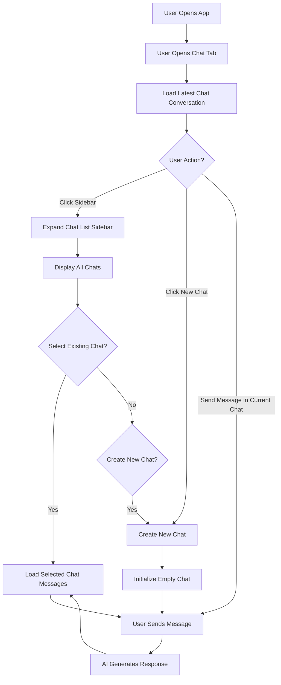
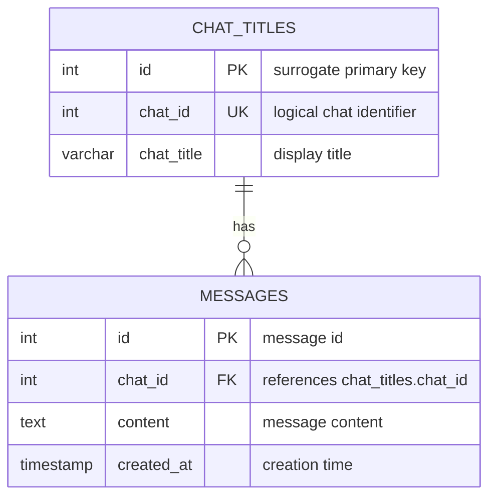

# How I Created and Optimised a Realtime AI Chat Messaging System

> My latest internship project involved building an AI-driven fullstack system. A key component was a chatbot that users could use to interact with the AI.

## Introduction

I wanted to make this feature-rich as possible, of course within practical means. After all, too many features lead to too many implementations which entails a more demanding and complicated design that can be hard to optimise later on.

So, I took inspiration from modern LLM chat websites such as **ChatGPT** and **Microsoft Copilot**.


*Above: Copilot's chat interface*

## Key Design Components

Consolidating all of the user-focused design features and avoiding anything superfluous, I summarised the key components the chat system should have:

- A button to create a new chat
- A sidebar to expand to show chat titles
- A title displaying current chat title
- A main dialog area showing user's conversations with the AI
- A text box accepting user input and a submit button

## User Workflow

Considering the current context to be a single instance interaction (1 user talking to the AI), the workflow I devised was something like this:


### User Workflow Diagram


---

## Data Persistence Strategy

There are some key stages where chat data need to be saved and retrieved from the data layer:

### Stage 1: While Chat Window is Open

| Scenario | Action |
|----------|--------|
| **1.1** User creates a new chat | Save current conversation data, then show empty chat box |
| **1.2** User views another chat | Save current conversation first, then display selected chat |
| **1.3** User closes chat window | Save latest conversation only (previous chats already saved) |

### Stage 2: When Opening the Chat Window

| Scenario | Action |
|----------|--------|
| **2.1** Initial load | Fetch all chat titles for sidebar display; show empty chatbox for new conversation |
| **2.2** User continues | Either start messaging in new chat, or select from saved chat titles |

---

## Implementing the Data Storage Strategy

From the above workflow, we need to expose several REST API endpoints. Let's define them and build the required components for a simple storage system.

> ⚠️ **Note:** Since I no longer have code access to this project (internship ended), I will use placeholder names and example response JSON bodies. This documentation focuses on the design perspective and does not contain any sensitive information.


### API Endpoints

**Referencing the workflow pointers (1.1, 1.2, 1.3):**

#### `POST /chat/data` — Save Chat Data

This endpoint handles both creating new chats and updating existing ones.

**Design Decision:** I initially considered creating a separate endpoint to create a new chat. However, this proved unnecessary since the save endpoint can create a chat entry and store contents automatically.

#### Data Structure (Backend Singleton)

I created a Singleton class with a hashmap in this format:

```json
{
  "chat_id": {
    "chat_title": "<string>",
    "messages": ["earliest message", "...", "latest message"]
  }
}
```

#### Request Body Schema

```json
{
  "chat_id": "<string>",
  "chat_title": "<string>",
  "messages": ["earliest message", "...", "latest message"]
}
```

> **Note:** The `messages` array contains messages ordered from earliest (index 0) to latest.

---

#### `GET /chats/{id}` — Get Chat Data by ID

Since the hashmap data structure is not persistent and gets wiped on server restart, we need proper **data modelling**.

---

## Database Design

### Entity Relationship Diagram

Throughout this discussion, we identified two key pieces of information:

1. **Chat titles** — metadata for each conversation
2. **Chat messages** — array of messages per conversation




  
    


    
    
    

