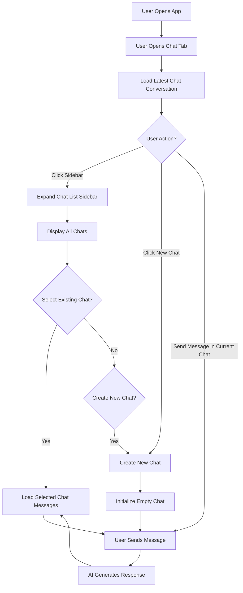
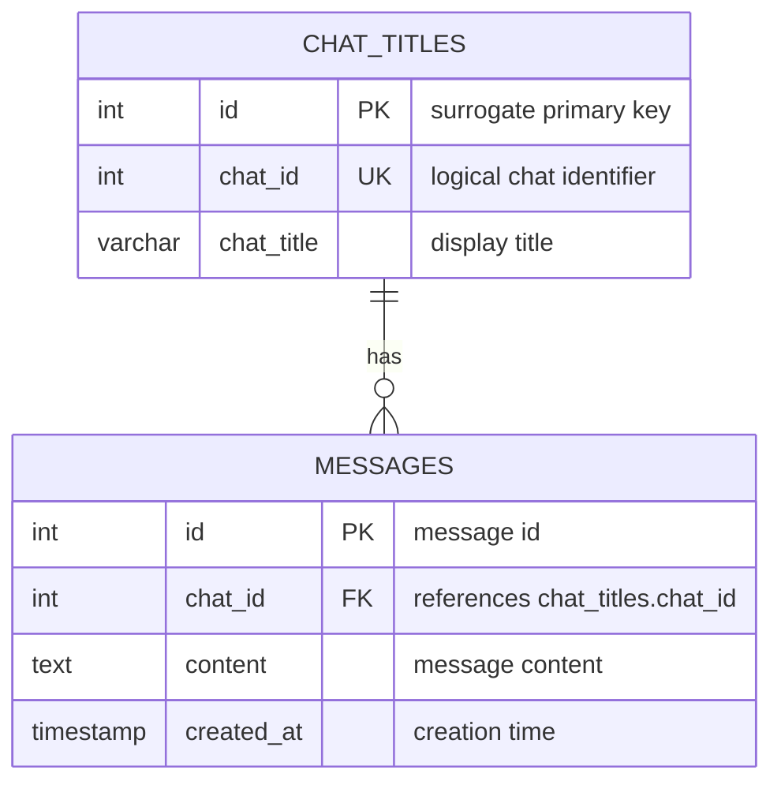

# How I Created and Optimised a Realtime AI Chat Messaging System

> My latest internship project involved building an AI-driven fullstack system. A key component was a chatbot that users could use to interact with the AI.

## Introduction

I wanted to make this feature-rich as possible, of course within practical means. After all, too many features lead to too many implementations which entails a more demanding and complicated design that can be hard to optimise later on.

So, I took inspiration from modern LLM chat websites such as **ChatGPT** and **Microsoft Copilot**.


*Above: Copilot's chat interface*

## Key Design Components

Consolidating all of the user-focused design features and avoiding anything superfluous, I summarised the key components the chat system should have:

- A button to create a new chat
- A sidebar to expand to show chat titles
- A title displaying current chat title
- A main dialog area showing user's conversations with the AI
- A text box accepting user input and a submit button

## User Workflow

Considering the current context to be a single instance interaction (1 user talking to the AI), the workflow I devised was something like this:


### User Workflow Diagram


---

## Data Persistence Strategy

There are some key stages where chat data need to be saved and retrieved from the data layer:

### Stage 1: While Chat Window is Open

| Scenario | Action |
|----------|--------|
| **1.1** User creates a new chat | Save current conversation data, then show empty chat box |
| **1.2** User views another chat | Save current conversation first, then display selected chat |
| **1.3** User closes chat window | Save latest conversation only (previous chats already saved) |

### Stage 2: When Opening the Chat Window

| Scenario | Action |
|----------|--------|
| **2.1** Initial load | Fetch all chat titles for sidebar display; show empty chatbox for new conversation |
| **2.2** User continues | Either start messaging in new chat, or select from saved chat titles |

---

## Implementing the Data Storage Strategy

From the above workflow, we need to expose several REST API endpoints. Let's define them and build the required components for a simple storage system.

> ⚠️ **Note:** Since I no longer have code access to this project (internship ended), I will use placeholder names and example response JSON bodies. This documentation focuses on the design perspective and does not contain any sensitive information.


### API Endpoints

**Referencing the workflow pointers (1.1, 1.2, 1.3):**

#### `POST /chat/data` — Save Chat Data

This endpoint handles both creating new chats and updating existing ones.

**Design Decision:** I initially considered creating a separate endpoint to create a new chat. However, this proved unnecessary since the save endpoint can create a chat entry and store contents automatically.

#### Data Structure (Backend Singleton)

I created a Singleton class with a hashmap in this format:

```json
{
  "chat_id": {
    "chat_title": "<string>",
    "messages": ["earliest message", "...", "latest message"]
  }
}
```

#### Request Body Schema

```json
{
  "chat_id": "<string>",
  "chat_title": "<string>",
  "messages": ["earliest message", "...", "latest message"]
}
```

> **Note:** The `messages` array contains messages ordered from earliest (index 0) to latest.

---

#### `GET /chats/{id}` — Get Chat Data by ID

Since the hashmap data structure is not persistent and gets wiped on server restart, we need proper **data modelling**.

---

## Database Design

### Entity Relationship Diagram

Throughout this discussion, we identified two key pieces of information:

1. **Chat titles** — metadata for each conversation
2. **Chat messages** — array of messages per conversation



In the messages table every new message is given an incrementing index of int id. Apart from that, it also has a chat_id. This chat_id is shared between both tables and used to identify the exact chat.

#### `GET /chat/titles/` — Get all Chat Titles

This API endpoint is used to get all chat titles upon first opening the chat window from the database.

---
So now, overall this is the entire workflow:

1. User opens chat window
   - call `/GET chat/titles/` to get all chat titles.
   - Chat titles, and corresponding ids used to identify each chat and its conversation data; fetched from this backend API, and consolidated at the frontend.
   - Frontend maps each chat selection button in the side panel, to the id of the specific chat.
   - User opens side tab to view all chats, or can start a new conversation
2. If user selects a chat,load chat conversation using `GET /chats/:id`
3. Upon selecting a new chat, creating a new chat (after conversing with the AI), or closing the window, call `POST chat/data/` to save latest ongoing conversation data, update both messages and chat titles tables in the db.

This is the current implementation, but I realised that by running this approach the server was interacting with the database for all API endpoints. The slowest endpoint `GET /chats/:id` was 422ms, and this was tested with ~10 message entries (counting user input and AI's responses). Performance improvements can be done.

## Using Redis as a write-aside cache

We can improve performance by using Redis as a write-aside cache connected in parallel with the main database to the backend server. Here is the improved sequence for data storage that I came up with for the last 1 week of my internship:
- Going through a typical user workflow:
--- Starting and Saving Conversations ---
1. User open chat window --> fetch all chat titles from the database.
2. User starts conversing with AI (Let us call this **Convo 1**)
3. User finds that to do another set of Resource Allocation Optimisations (this chat feature is part of the AI-Driven Resource Monitoring system after all) he/she chooses to create a new chat. Let us call this **Convo 2**.
4. We thus **first save the current conversation  (Convo 1) to the cache**, and then asynchronously write to the database as we proceed to the next chat. That done, when the user wants to revisit any old chats, they are in the cache and retrieval time is very fast. We have thus improved `GET chats/:id` in tbis aspect.
5. So now the user has finished conversing with the AI **(Convo 2)**, optimising all that is needed in the greater client dashboard. He/she now closes the window. At this point, we write **Convo 2** to the database.
<br></br>
--- Reopening the Chat window, and continuing off a conversation ---
1. Now the user reopens the chat window. If the server has been restarted the default chat_id is set to -1, and a new, blank chat interface greets the user, waiting for a new conversation to start. Otherwise, if its still within the same server session the chat_id remains to be the latest chat conversation, which is **Convo 2** in this case.
2. **Convo 2** is in the database and not in the cache, so this is a cache miss. We reach into the database, fetch the latest N messages (configurable) and display them client-side. When the user scrolls up, a button appears to "load more messages". Clicking this button will prompt the system to fetch the next N messages. Internally within the server, and the Singleton class I mentioned earlier, we include another hashmap mapping a chat_id -> a count value representing how many times the user has clicked the "load more messages" button. This acts as demarcating index so we know what is the next upper bound of messages we need to fetch. Since upon startup we also fetch the latest N messages, we can ensure that subsequent fetches will always increase the conversation log by factors of N. This 'count' value associated and varying for every chat_id, is essentially this "factor".
3. The next time the user clicks to view **Convo 1** instead of **Convo 2**, the latter now gets saved to the cache as well **(only latest N messages)**, as well as being updated to the DB. As emphasised, even the cache only contains the latest N messages, for we do not want to bloat the cache unnecesarily. **Only** the database contains the full log that is updated every time.
---

Key Considerations (in hindsight):
Some thoughts I remember were going through my mind when implementing this storage strategy:
- Clicking to preview another chat should be a quick operation, so we need to ensure that cache hits are high for this. We do not want the user to create a new chat, converse with the AI and realise that he/she needed information about past optimisations which can be found in a pre-existing chat, select said pre-existing chat and then suffer a wait of half a second to fetch all data, slowly and with noticeable lag client side even in terms of DOM renders. This was a personal experience borne from my own testing. **Hence**, the use of this **write-through caching strategy** where data is stored both on the cache and db, upon selecting a pre-existing chat or creating a new one.
- From my perspective, the AI chatbot is more write heavy than read-heavy. So, the need to control precisely when we update both the cache and database through the **write-through** pattern is neccesary. That is why I chose to bind it to user action, and the key actions include selecting a pre-existing chat, creating a new one and closing the window entirely. 


Ultimately this design was conceived in a limited time, and now there are certainly areas that warrant improvement - for example if user's repearedly toggle between chats, then we are performing **write-through** repeatedly in a short period of time, causing strain on the system. However, overall it was a really insightful and fun way of learning caching using Redis, and implementing a data storage workflow from scratch. 


  
    


    
    
    

