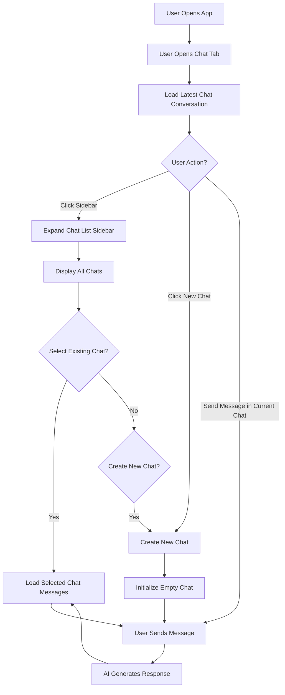
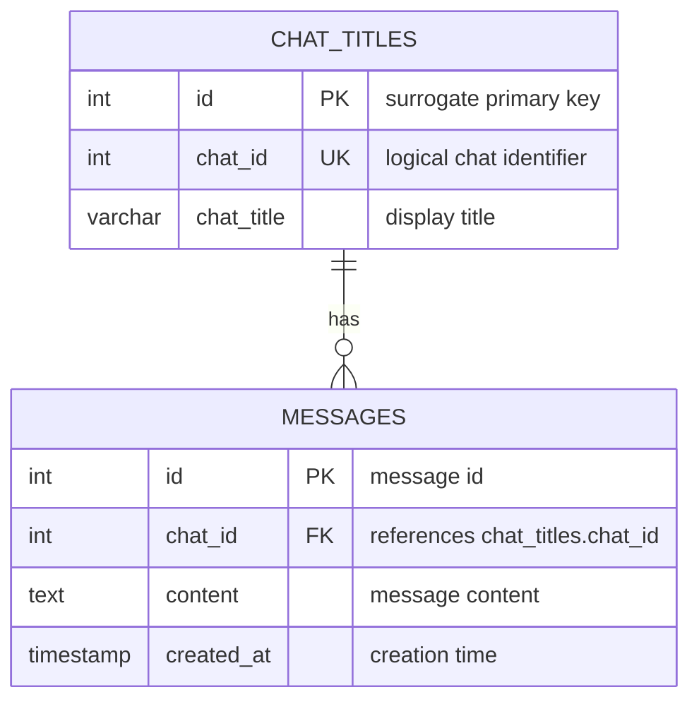

# How I Created and Optimised a Realtime AI Chat Messaging System

> My latest internship project involved building an AI-driven fullstack system. A key component was a chatbot that users could use to interact with the AI.

## Introduction

I wanted to make this feature-rich as possible, of course within practical means. After all, too many features lead to too many implementations which entails a more demanding and complicated design that can be hard to optimise later on.

So, I took inspiration from modern LLM chat websites such as **ChatGPT** and **Microsoft Copilot**.


*Above: Copilot's chat interface*

## Key Design Components

Consolidating all of the user-focused design features and avoiding anything superfluous, I summarised the key components the chat system should have:

- A button to create a new chat
- A sidebar to expand to show chat titles
- A title displaying current chat title
- A main dialog area showing user's conversations with the AI
- A text box accepting user input and a submit button

## User Workflow

Considering the current context to be a single instance interaction (1 user talking to the AI), the workflow I devised was something like this:


### User Workflow Diagram


---

## Data Persistence Strategy

There are some key stages where chat data need to be saved and retrieved from the data layer:

### Stage 1: While Chat Window is Open

| Scenario | Action |
|----------|--------|
| **1.1** User creates a new chat | Save current conversation data, then show empty chat box |
| **1.2** User views another chat | Save current conversation first, then display selected chat |
| **1.3** User closes chat window | Save latest conversation only (previous chats already saved) |

### Stage 2: When Opening the Chat Window

| Scenario | Action |
|----------|--------|
| **2.1** Initial load | Fetch all chat titles for sidebar display; show empty chatbox for new conversation |
| **2.2** User continues | Either start messaging in new chat, or select from saved chat titles |

---

## Implementing the Data Storage Strategy

From the above workflow, we need to expose several REST API endpoints. Let's define them and build the required components for a simple storage system.

> ⚠️ **Note:** Since I no longer have code access to this project (internship ended), I will use placeholder names and example response JSON bodies. This documentation focuses on the design perspective and does not contain any sensitive information.


### API Endpoints

**Referencing the workflow pointers (1.1, 1.2, 1.3):**

#### `POST /chat/data` — Save Chat Data

This endpoint handles both creating new chats and updating existing ones.

> **Design Decision:** I initially considered creating a separate endpoint to create a new chat. However, this proved unnecessary since the save endpoint can create a chat entry and store contents automatically.

#### Data Structure (Backend Singleton)

I created a Singleton class with a hashmap in this format:

```json
{
  "chat_id": {
    "chat_title": "<string>",
    "messages": ["earliest message", "...", "latest message"]
  }
}
```

#### Request Body Schema

```json
{
  "chat_id": "<string>",
  "chat_title": "<string>",
  "messages": ["earliest message", "...", "latest message"]
}
```

> **Note:** The `messages` array contains messages ordered from earliest (index 0) to latest.

#### `GET /chats/{id}` — Get Chat Data by ID

Since the hashmap data structure is not persistent and gets wiped on server restart, we need proper **data modelling**.

---

## Database Design

### Entity Relationship Diagram

Throughout this discussion, we identified two key pieces of information:

1. **Chat titles** — metadata for each conversation
2. **Chat messages** — array of messages per conversation



In the messages table every new message is given an incrementing index of int id. Apart from that, it also has a chat_id. This chat_id is shared between both tables and used to identify the exact chat.

#### `GET /chat/titles/` — Get All Chat Titles

This API endpoint is used to get all chat titles upon first opening the chat window from the database.

---

### Complete Workflow Summary

1. **User opens chat window**
   - Call `GET /chat/titles/` to fetch all chat titles
   - Chat titles and corresponding IDs are fetched from the backend API and consolidated at the frontend
   - Frontend maps each chat selection button in the side panel to the specific chat's ID
   - User opens side tab to view all chats, or starts a new conversation

2. **User selects a chat** → Load chat conversation using `GET /chats/:id`

3. **User switches/creates/closes chat** → Call `POST /chat/data/` to save the latest ongoing conversation data and update both `messages` and `chat_titles` tables in the database

### Performance Observations

With this implementation, the server was interacting with the database for all API endpoints. The slowest endpoint `GET /chats/:id` was **422ms**, tested with ~10 message entries (counting user input and AI responses). Performance improvements were needed.

## Using Redis as a Write-Aside Cache

We can improve performance by using Redis as a write-aside cache connected in parallel with the main database to the backend server. Here is the improved sequence for data storage that I came up with for the last week of my internship.

### Typical User Workflow

#### Starting and Saving Conversations

1. User opens chat window → fetch all chat titles from the database
2. User starts conversing with AI (let's call this **Convo 1**)
3. User decides to do another set of Resource Allocation Optimisations and chooses to create a new chat (let's call this **Convo 2**)
4. We **first save the current conversation (Convo 1) to the cache**, then asynchronously write to the database as we proceed to the next chat. When the user wants to revisit old chats, they are in the cache and retrieval time is very fast — this improves `GET /chats/:id` performance
5. User finishes conversing with the AI (**Convo 2**) and closes the window. At this point, we write **Convo 2** to the database

#### Reopening the Chat Window

1. User reopens the chat window:
   - If the server has restarted → `chat_id` defaults to `-1`, showing a blank chat interface
   - If still within the same server session → `chat_id` remains as the latest conversation (**Convo 2**)

2. **Convo 2** is in the database but not in the cache (cache miss). We:
   - Fetch the latest **N** messages (configurable) from the database
   - Display them client-side
   - When the user scrolls up, a "Load More Messages" button appears
   - Clicking this button fetches the next **N** messages

3. Internally, the Singleton class maintains a hashmap: `chat_id → count` representing how many times the user clicked "Load More Messages". This serves as a demarcating index for fetching the next batch of messages.

4. When the user clicks to view **Convo 1** instead of **Convo 2**:
   - **Convo 2** gets saved to the cache (only latest **N** messages) and updated in the DB
   - The cache intentionally stores only the latest **N** messages to avoid bloat
   - **Only** the database contains the full conversation log

---

### Key Considerations

> Some thoughts I had while implementing this storage strategy:

| Consideration | Reasoning |
|---------------|-----------|
| **Fast chat switching** | Clicking to preview another chat should be quick. We need high cache hit rates to avoid the user experiencing a half-second delay with noticeable client-side lag. This personal testing experience led to the **write-through caching strategy**. |
| **Write-heavy workload** | The AI chatbot is more write-heavy than read-heavy. Precise control over when we update both cache and database is necessary. I bound updates to user actions: selecting a chat, creating a new one, or closing the window. |

---

### Future Improvements

Ultimately this design was conceived in limited time, as my internship was ending and I needed to wrap up. Nevertheless, some areas that warrant improvement:

- **Chat toggling overhead** — If users repeatedly toggle between chats, we perform write-through operations repeatedly in a short period, causing strain on the system
- **Cache eviction policy** — Implementing a proper LRU eviction strategy could further optimise memory usage, such as when the cache capacity reaches a limit, then we remove the Redis Hashset key that was least recently used. Tracking of whether or not a cache entry is least recently used can be done server side.
- A more robust saving approach beyond just being limited to user action. This comes as when the server fails mid conversation without the user doing any of these 3 actions prior such as closing the chat window, select pre-existing chats or create a new chat; then data for the latest interrupted conversation would be lost.

---

## Conclusion

Overall, this was an insightful and enjoyable way to learn caching using Redis and implement a data storage workflow from scratch. 


  
    


    
    
    

