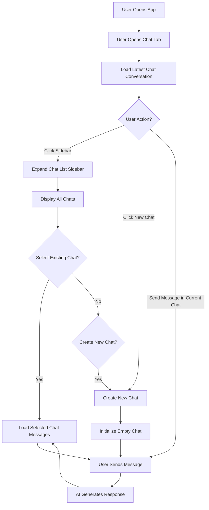

### How I Created and Optimised a realtime AI chat messaging system for my latest internship project.

My latest internship project involved doing up an AI-driven fullstack system. A key component was a chatbot that users could use to interact with the AI.

I wanted to make this feature-rich as possible, of course within practical means. After all, too many features lead to too many implementations which entails a more demanding, and complicated design that can be hard to optimise later on. 

So, I took inspiration from modern LLM chat websites such as ChatGPT, and Microsoft Copilot.


- Above, an image of Copilot's chat interface.

Therefore, consolidating all of the user-focused design features and avoiding anything superfluous, I hence summarised the key components the chat system should have:

	- A button to create a new chat
    - A sidebar to expand to show new chat titles
    - A title displaying current chat title
    - A main dialog area showing user's conversations with the AI
    - A text box accepting user input and of course a simple button for submit.
    
So, rudimentarily considering the current context to be a single instance interaction (1 user talking to the AI), the workflow I devised was something like this:


A possible user-workflow diagram can be like this:



Therefore, there are some key stages where chat data need to be saved and retrieved from the data layer:

### [1]: While chat window is opened:

- 1.1. When user clicks to create a new chat, save the chat data from current conversation. Show new empty chat box to start conversations.

- 1.2. When a user chooses to view other chats apart from the current one, save the present chat conversation first, before displaying the other chats in the main chat box.

- 1.3. When user closes the chat window, save the chat data from the latest conversation. Since beforehand in (1) and (2) we have been saving chat data from other conversations not already marked as the present one, we do not need to do a "batch saving" of all chat conversations whenever the user closes the chatbot window.

### [2]: When opening the chat window:

- 2.1. First, we want to fetch all chat titles from the data layer. These chat titles can then be displayed on the sidebar which can be expanded or hidden. Upon opening the chat, the user is greeted with an empty chatbox depicting a brand new conversation that can be started. Same sequence as ChatGpt and Copilot.

- 2.2. The user can then start messaging the AI **either** on this new chat, or select from the list of already saved and then retrieved chat titles for a past ongoing conversation, and continue from there. This brings us back to the brief workflows mentioned above in [1].
----

### Implementing a strategy for saving data:

Simply from the above, we can see that we need to expose quite a REST API endpoints for the above steps. Let us define them now, and also along the way slowly build the required components for a simple storage system.
---

_(Since I no longer have code access to this project as my internship is ended, I will use placeholder names and example response JSON bodies. Rest assured that this is just my own documentation of how I created a chat system, and does not contain anything that is sensitive to the internship and what I did internally. Ultimately, developing this system from a design perspective was what intruiged me the most)._


**Referencing the above workflow pointers**:
- 1.1 and 1.3 : As we save the contents of the current conversation, let us declare:
  	- **HTTP POST chat/data (Endpoint to save chat data information)**
  	- I was deliberating about creating an endpoint to create a new chat, and store it. However, I soon decided that it was not neccesary because the above endpoint to save chat data can essentially create a chat entry and thus save the contents automatically.
  	- Therefore, it is actually now high-time that we define the data structure to store our chats. Essentially, within the backend server (not going down into the data layer yet) we need to create an object class that stores all of our chats.
  	- Essentially, I created a Singleton class that has a hashmap in this format:
		```
		{
		chat_id <string> : {
			"chat_title" : <string>,
			"messages" : [earliest message <string>,........,latest message <string>]
			},
		}
		```
  	- So, we can both update a current chat if its id is already present, or create a new entry. 
  	- Following this, the request body for HTTP POST chat/data can be:
  	  ```
  	  {
  	  		"chat_id" : <string>, --> can be a digit. We can use digits so that all chats can be indexed in the database that stores all the data.
			"chat_title" : <string>,
			"messages" : [earliest message <string>,........,latest message <string>]
	  },
  	  ```
  	- We can see that the value for the "messages" key is an array containing the earliest to latest message from left to right.
- 1.2 : As we choose to view another chat and save the contents of the current conversation, we can call 1.1's above endpoint to first save the data. Then we declare:
  	- **HTTP GET chats/id (Endpoint to get all chat data for a particular id)**
  	- Since the hashmap data structure is not persistent and gets wiped on server restart, we can now proceeed to do some **Data Modelling**
 
#### Entity Relationship Diagrams for Database.

Throughout discussion we can see that there are two key pieces of information:
- Chat titles
- Chat conversation, which is an array of messages.

Therefore, we can design our ERD as such:


  
    


    
    
    

